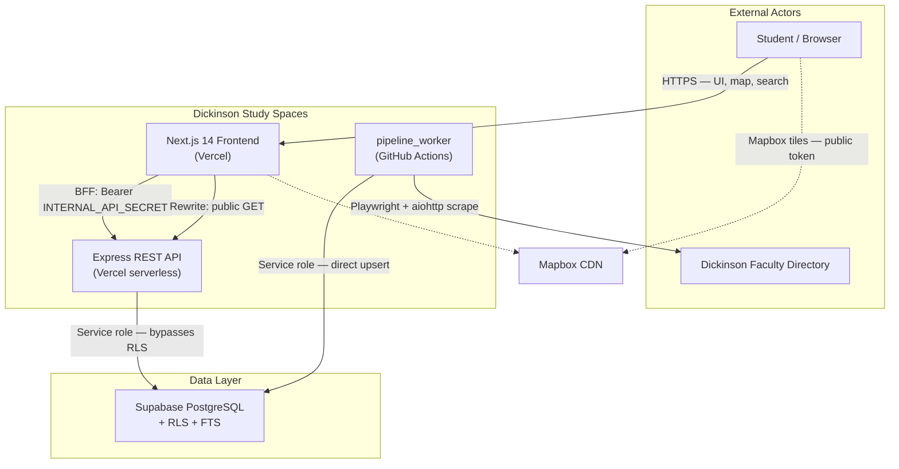
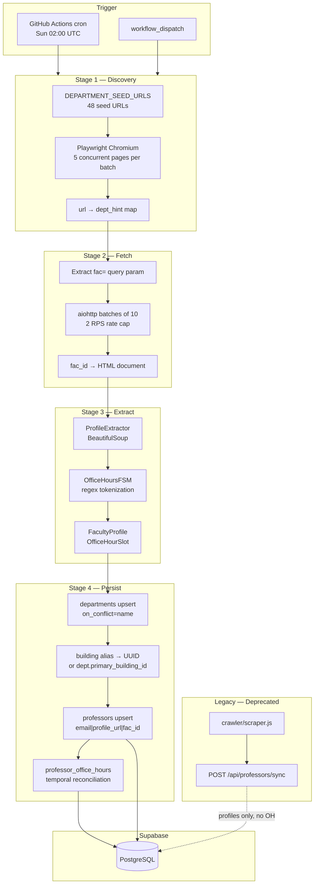
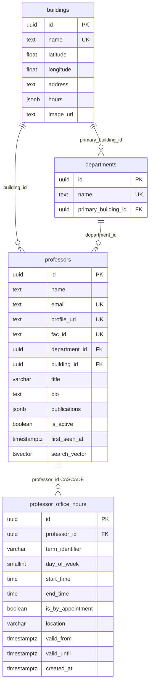

# Dickinson Study Spaces — System Architecture

This document describes the system design of Dickinson Study Spaces: a campus intelligence platform for study-space discovery, interactive mapping, faculty search, and automated faculty data ingestion. For operational setup (installation, environment variables, migration bootstrap), see [README.md](README.md).

---

## 1. Executive Summary

Dickinson Study Spaces is a full-stack web application that helps Dickinson College students locate study spaces and discover faculty availability. The system comprises four primary containers:

| Container | Technology | Responsibility |
|-----------|------------|----------------|
| **Frontend** | Next.js 14 (App Router), React 18, TanStack Query | Client UI, map rendering, BFF proxy for protected routes |
| **Backend API** | Node.js 22, Express | REST API, Supabase access via service role, hybrid static/dynamic building data |
| **Ingestion Pipeline** | Python 3.10+, Playwright, Pydantic, asyncio | Weekly faculty profile crawl, parse, and temporal upsert |
| **Database** | Supabase (PostgreSQL), RLS, FTS | Source of truth for professors, departments, office hours, building UUIDs |

External dependencies: Mapbox GL JS (client-side map tiles), Dickinson College faculty directory (scrape target), GitHub Actions (scheduled pipeline execution).

**Live deployment:** [https://dson-study-spaces.vercel.app/home](https://dson-study-spaces.vercel.app/home)

### Logical layers (codebase map)

These layers match how the repository is organized for navigation (also reflected in the Understand Anything knowledge graph):

| Layer | Responsibility | Primary paths |
|-------|----------------|---------------|
| **Frontend UI** | App Router pages, map shell, cards, directory | `front-end/src/app/` |
| **Frontend Services** | Distance/sort/filter, live-mode helpers, TanStack hooks, env | `front-end/services/`, `front-end/src/hooks/`, `front-end/src/lib/` |
| **Backend API** | Express REST, auth middleware, hybrid buildings merge | `back-end/api/` |
| **Data Schema** | Temporal OH, FTS, identity keys, RLS | `supabase/migrations/` |
| **Ingestion Pipeline** | Discover → fetch → parse → upsert | `pipeline_worker/` |
| **Infrastructure** | CI schedules, Vercel entry | `.github/workflows/`, `back-end/vercel.json` |
| **Documentation** | Ops + design docs | `README.md`, `ARCHITECTURE.md` |
| **Deprecated Legacy** | Node crawler + scraper workflow (manual; exits 1) | `crawler/`, `.github/workflows/scraper.yml` |

---

## 2. Architecture Principles

These principles are derived from implementation choices in the codebase, not aspirational policy.

| Principle | Definition | Evidence |
|-----------|------------|----------|
| **Database as source of truth** | All relational faculty data and building UUIDs authoritative in Supabase; static JSON supplements display metadata only | `professors`, `professor_office_hours`, `departments`, `buildings` tables; [back-end/api/data/data.json](back-end/api/data/data.json) merged at read time |
| **Backend-for-Frontend (BFF)** | Next.js route handlers inject server-only secrets before upstream API calls; browser never receives privileged credentials | [front-end/src/app/api/buildings/route.js](front-end/src/app/api/buildings/route.js) |
| **Stateless serverless UI** | No server-side session store; client-heavy `/home` shell; server state cached via TanStack Query | [front-end/src/app/providers.js](front-end/src/app/providers.js), hooks in [front-end/src/hooks/](front-end/src/hooks/) |
| **Mobile-first responsive grid** | Viewport locked with `100dvh`; vertical stack on mobile, horizontal split on desktop; safe-area insets on overlays | [front-end/src/app/styles/globals.css](front-end/src/app/styles/globals.css), [front-end/src/app/home/page.js](front-end/src/app/home/page.js) |
| **Imperative WebGL boundary** | Mapbox GL instance and DOM markers managed outside React reconciliation; refs hold map state, not React state | [front-end/src/app/components/Map.js](front-end/src/app/components/Map.js) |
| **Temporal data model** | Office hours versioned via `valid_from` / `valid_until`; active rows have `valid_until IS NULL` | [supabase/migrations/20250314000000_temporal_professor_schema.sql](supabase/migrations/20250314000000_temporal_professor_schema.sql), [pipeline_worker/pipeline_worker/main_orchestrator.py](pipeline_worker/pipeline_worker/main_orchestrator.py) |
| **Identity-key idempotency** | Professor upserts keyed by `email` → `profile_url` → `fac_id`; name-only matching prohibited | [back-end/api/routes/professors.js](back-end/api/routes/professors.js), [supabase/migrations/20250525000000_professor_identity_keys.sql](supabase/migrations/20250525000000_professor_identity_keys.sql) |
| **Single-writer ingestion** | One pipeline (`pipeline_worker`) owns faculty writes; legacy Node crawler deprecated | [crawler/scraper.js](crawler/scraper.js), [.github/workflows/scraper.yml](.github/workflows/scraper.yml) (exits with error) |

---

## 3. System Context (C4 Level 1)

The diagram below shows the system boundary, external actors, and trust boundaries between containers.



**Trust boundaries:**

- **Browser ↔ Next.js:** Public. `NEXT_PUBLIC_MAPBOX_TOKEN` is intentionally client-exposed. No session cookies or JWTs.
- **Next.js ↔ Express (buildings):** Server-to-server. `INTERNAL_API_SECRET` injected by BFF route handler only.
- **Browser ↔ Express (professors):** Transparent rewrite through Next.js origin. Professor read endpoints require no client secret; RLS restricts writes.
- **Pipeline ↔ Supabase:** CI secrets only. No runtime coupling to Express.

---

## 4. Data Ingestion Flow

Faculty data enters the system exclusively through `pipeline_worker`, scheduled weekly via GitHub Actions. The legacy Node crawler (`crawler/scraper.js`) and `POST /api/professors/sync` endpoint remain for backward compatibility but are not the primary write path — the pipeline writes directly to Supabase with the service role key.



### Stage detail

| Stage | Module | Concurrency | Output |
|-------|--------|-------------|--------|
| 1 — Discovery | [discovery_playwright.py](pipeline_worker/pipeline_worker/crawlers/discovery_playwright.py) | 48 seed URLs; 5 Playwright pages/batch; 0.5s inter-batch pause; 3 retry attempts | `dict[profile_url → department_hint]` |
| 2 — Fetch | [main_orchestrator.py](pipeline_worker/pipeline_worker/main_orchestrator.py) | 10 concurrent aiohttp requests; `sleep(batch_size / 2.0)` → 2 RPS | `(fac_id, html \| None)` tuples |
| 3 — Extract | [html_scraper.py](pipeline_worker/pipeline_worker/parsers/html_scraper.py), [office_hours_fsm.py](pipeline_worker/pipeline_worker/parsers/office_hours_fsm.py) | Sequential per profile | `FacultyProfile` (Pydantic) |
| 4 — Persist | `upsert_to_supabase()` in orchestrator | Sequential (sync supabase-py v2) | Rows in `departments`, `professors`, `professor_office_hours` |

### Temporal office-hours reconciliation

When scraped office hours differ from active database rows (fingerprint mismatch on `(day_of_week, start_time, end_time, is_by_appointment, location)`):

1. Load active rows: `valid_until IS NULL`
2. If fingerprints equal → **no-op** (idempotent re-run)
3. Set `valid_until = NOW()` on all active row IDs (expire)
4. Insert new rows with `term_identifier` from `_current_term()` (Spring/Summer/Fall)
5. On insert failure → **compensating rollback**: restore `valid_until = NULL` on expired IDs

This flow is not fully transactional through supabase-py; rollback mitigates orphan temporal state but does not guarantee atomicity under concurrent pipeline runs.

### GitHub Actions concurrency

```yaml
concurrency:
  group: data-pipeline
  cancel-in-progress: false
```

Overlapping runs are permitted to finish rather than being cancelled mid-write.

---

## 5. BFF Proxy Flow

Building data requires authenticated access at the Express layer. The frontend implements a Backend-for-Frontend pattern: a Next.js Route Handler intercepts `/api/buildings` before the catch-all rewrite, injects the server-only secret, and passthroughs the upstream response.

Professor routes use the rewrite only — no secret injection, public read at the API layer.

```mermaid
sequenceDiagram
  participant Browser
  participant NextRoute as Next.js Route Handler
  participant NextRewrite as Next.js Rewrite
  participant Express
  participant Supabase
  participant DataJson as data.json

  Note over Browser,DataJson: Buildings path — BFF with secret injection

  Browser->>NextRoute: GET /api/buildings
  Note over Browser,NextRoute: Client may attach ?lat=&lng= for local Vincenty sort;<br/>Express ignores those query params
  NextRoute->>NextRoute: Read INTERNAL_API_SECRET (or INTERNAL_API_KEY) from env
  NextRoute->>Express: fetch BACKEND_URL/api/buildings<br/>Authorization: Bearer SECRET
  Express->>Express: buildingsAuthMiddleware validates Bearer
  Express->>DataJson: loadStaticBuildings()
  Express->>Supabase: SELECT id, name FROM buildings
  Express->>Express: mergeSupabaseBuildingIds(); status via server local time
  Express-->>NextRoute: JSON { data: Building[] }
  NextRoute-->>Browser: Passthrough body + Cache-Control

  Note over Browser,Supabase: Professors path — transparent rewrite

  Browser->>NextRewrite: GET /api/professors?q=smith
  NextRewrite->>Express: Proxy to BACKEND_URL/api/professors
  Express->>Supabase: RPC search_professors_fts OR direct query
  Express-->>Browser: JSON { data: Professor[] }
```

### API resolution order

Next.js resolves requests in this order:

1. **Filesystem route handlers** — `src/app/api/buildings/route.js` wins for `GET /api/buildings`
2. **Rewrites** — `next.config.mjs` `source: "/api/:path*"` handles all other `/api/*` paths

```javascript
// front-end/next.config.mjs
async rewrites() {
  const proxyTarget = process.env.BACKEND_URL ?? publicApiUrl;
  return [{ source: "/api/:path*", destination: `${proxyTarget}/api/:path*` }];
}
```

### Dual URL model

| Variable | Scope | Purpose |
|----------|-------|---------|
| `NEXT_PUBLIC_API_URL` | Client + build | Browser-facing origin; professor hooks call `${API_URL}/api/professors` |
| `BACKEND_URL` | Server only | Target for BFF `fetch()` and rewrite proxy (e.g. `http://localhost:3002` in dev) |

Defined in [front-end/src/lib/env.js](front-end/src/lib/env.js). Buildings client code uses relative `/api/buildings` (same-origin BFF); professor hooks use absolute `NEXT_PUBLIC_API_URL`.

---

## 6. Container Breakdown (C4 Level 2)

### 6.1 Frontend — `front-end/`

**Stack:** Next.js 14 (App Router), React 18, Tailwind CSS, TanStack Query v5, Radix UI, Mapbox GL JS v3.

#### Route structure

| Path | File | Rendering |
|------|------|-----------|
| `/` | [src/app/page.js](front-end/src/app/page.js) | Client redirect → `/home` |
| `/home` | [src/app/home/page.js](front-end/src/app/home/page.js) | Main application shell (client component) |
| `/api/buildings` | [src/app/api/buildings/route.js](front-end/src/app/api/buildings/route.js) | Server route handler (BFF) |

Root layout ([src/app/layout.js](front-end/src/app/layout.js)) wraps all pages in `<Providers>` with font variables and `viewportFit: "cover"` for notched devices.

#### State management

TanStack Query handles all server-state fetching:

| Hook / Query | Key | Endpoint | Caching | Notes |
|--------------|-----|----------|---------|-------|
| `useQuery` (inline) | `["buildings", lat, lng]` | `/api/buildings` | Default `staleTime: 0` | Vincenty distance sort client-side after fetch |
| `useDepartments` | `["departments"]` | `/api/professors/departments` | `staleTime: Infinity` | Loaded once per session |
| `useProfessors` | `["professors", q, deptId, liveSync]` | `/api/professors` | `staleTime: 30_000` | 300ms debounce in UI; `liveSync` option exists but UI currently always passes `false` |
| `useActiveNowBuildingIds` | `["professors", "active-now"]` | `/api/professors/active-now` | `staleTime: 30_000`, `refetchInterval: 60_000` | Enabled only when live mode is active |
| `useLiveTime` | — | — | 60s tick | Local `setInterval` for campus-time UI refresh |

No global Redux/Zustand store. Ephemeral UI state (sidebar collapse, active view, time travel hour) lives in `home/page.js` local state.

#### WebGL / React boundary — `Map.js`

Mapbox GL owns the WebGL canvas. React owns overlay chrome (controls, token-missing banner, context-lost recovery UI). The architectural contract:

| Concern | Implementation |
|---------|----------------|
| Map instance | `mapRef = useRef()` — never stored in React state |
| Markers | Imperative `document.createElement` + `mapboxgl.Marker`; stored in `markersRef` |
| Marker rebuild trigger | `buildingIdsKey` — sorted ID string; rebuilds only when building *set* changes, not on sort/filter reorder |
| WebGL recovery | `mapRemountKey` incremented on manual reload; full teardown via `map.remove()` in effect cleanup |
| Context loss | `webglcontextlost` / `webglcontextrestored` listeners on canvas |
| Style updates | `applyAllMarkerStyles()` callback — mutates DOM directly for open/closed, live mode dimming, highlight scale |
| Parent API | `useImperativeHandle` exposes `flyToLocation(lat, lng)` for ProfessorCard / BuildingDirectory |

**Coordinate convention:** Building data stores `[lat, lng]`. Mapbox expects `[lng, lat]`. Conversion occurs at marker creation and `flyTo` calls.

Map configuration: `mapbox://styles/mapbox/standard` with `lightPreset: "night"`, `projection: "globe"`, `cooperativeGestures: true`. Mobile pitch 45° (via `matchMedia`), desktop 60°.

There is **no** `map.on('move')` handler syncing camera position into React state. Pan and zoom operate entirely within Mapbox's render loop, avoiding 60fps React re-renders during gesture interaction.

#### Responsive shell — `dvh` layout

Viewport height is locked at three layers to prevent mobile browser chrome from breaking layout:

```
html, body, #__next  →  height: 100dvh; overflow: hidden   (globals.css)
Providers wrapper    →  h-[100dvh] overflow-hidden          (providers.js)
Home main            →  flex flex-col md:flex-row-reverse h-[100dvh]  (home/page.js)
```

Mobile layout: vertical stack — map region `flex-1 min-h-[40dvh]`, sidebar panel `h-[min(55dvh, 28rem)]`. Desktop: row-reverse — sidebar `md:w-[min(100%,20rem)] lg:w-1/4`, map fills remainder. Collapsed sidebar shrinks to `md:w-16` icon strip.

Safe-area padding applied via `env(safe-area-inset-*)` on map controls, live mode toggle, time travel slider, and professor search slide-over. Touch targets enforce 44px minimum via `.touch-target` utilities in globals.css.

#### Live mode — dual evaluation path

| Surface | Data source | Mechanism |
|---------|-------------|-----------|
| Map marker dimming | Server | `GET /api/professors/active-now` → `useActiveNowBuildingIds` → building UUID set |
| Professor list filter | Client | `isProfessorInOffice()` in [liveMode.js](front-end/services/liveMode.js) filters fetched professors |

Both paths use campus timezone `America/New_York` ([utils.js](front-end/src/lib/utils.js)). The server path queries relational `building_id` on joined professors; the client path evaluates `professor_office_hours` rows on already-fetched data.

#### Services layer

| Module | Responsibility |
|--------|----------------|
| [distance.js](front-end/services/distance.js) | Fetch `/api/buildings`, Vincenty distance calculation, client-side open/closed enrichment |
| [operation.js](front-end/services/operation.js) | Sort (Closest, Furthest, Highest Rated, Name) and filter (Open/Closed) using campus ET |
| [liveMode.js](front-end/services/liveMode.js) | `isProfessorInOffice`, `getActiveBuildingIds` (exported, unused by UI), `matchBuildingFromLocation` |

**Timezone split (do not overstate ET coverage):**

| Path | Timezone used for open/closed or “in office” |
|------|-----------------------------------------------|
| `operation.js`, `Map.js`, cards, live-mode client checks, `GET /api/professors/active-now` | Campus `America/New_York` |
| `distance.js` fetch enrichment (`status` on building objects) | **Browser local** |
| Express `GET /api/buildings` `status` field | **Server local** |

Production cards/map mostly re-evaluate with campus ET; the API `status` field and `distance.js` enrichment can disagree for non-ET users until UI recomputation.

---

### 6.2 Backend — `back-end/`

**Stack:** Node.js 22, Express 4, `@supabase/supabase-js`, helmet, cors, winston.

#### Middleware stack

Applied in order in [api/index.js](back-end/api/index.js):

```
express.json({ limit: '5mb' })
  → helmet()
  → cors({ origin: isAllowedOrigin, credentials: true })
  → route handlers
  → global error handler (500)
```

#### CORS policy

| Origin | Allowed |
|--------|---------|
| No `Origin` header (server-to-server) | Yes |
| `http://localhost:3000` | Yes |
| `https://dson-study-spaces.vercel.app` | Yes |
| Any `*.vercel.app` | Yes |
| `ALLOWED_ORIGIN_EXTRA` env var | Yes (single additional origin) |

Methods: `GET`, `POST`, `OPTIONS`. Headers: `Content-Type`, `Authorization`.

#### Authentication boundaries

| Route | Middleware | Secret env var | Failure mode |
|-------|------------|----------------|--------------|
| `GET /api/buildings` | `buildingsAuthMiddleware` | `INTERNAL_API_SECRET` (alias: `INTERNAL_API_KEY`) | Missing secret → **500**; wrong/missing header → **401** |
| `POST /api/professors/sync` | Inline in route | `INTERNAL_CRON_SECRET` | Missing/wrong → **401** |
| `GET /api/professors/*` | None | — | Public read |

Buildings auth requires exact match: `Authorization: Bearer <secret>`. Sync auth accepts raw secret or `Bearer <secret>`.

#### Supabase client — `db.js`

- Lazy singleton via `getSupabase()`
- HTTP transport only (`@supabase/supabase-js`) — no Postgres socket connections from the API process
- Requires `SUPABASE_URL` + `SUPABASE_SERVICE_ROLE_KEY`
- Optional `DATABASE_URL` validated: must use transaction pooler port **6543** with `?pgbouncer=true`; port **5432 rejected**
- Service role **bypasses RLS** on all API queries

#### Buildings route — hybrid static/dynamic

[api/routes/buildings.js](back-end/api/routes/buildings.js):

1. Load [api/data/data.json](back-end/api/data/data.json) (19 buildings) — cached in memory after first read
2. Compute open/closed from per-day hour ranges (server local time)
3. Attach slug via `buildingSlug(name)`
4. Merge Supabase UUIDs by exact `name` match; fallback `id = slug` on lookup failure

Response: `{ data: Building[] }` with `Cache-Control: public, max-age=300`.

#### Professors route

[api/routes/professors.js](back-end/api/routes/professors.js):

| Endpoint | Query mechanism | Cache |
|----------|-----------------|-------|
| `GET /departments` | `departments.select('*').order('name')` | 300s |
| `GET /active-now` | Join `professor_office_hours` + `professors!inner(building_id)`; filter by campus ET | 60s |
| `GET /` with `q` | RPC `search_professors_fts` (websearch_to_tsquery + ts_rank) | 60s |
| `GET /` without `q` | Direct query with nested `departments(name)`, `professor_office_hours(*)` | 60s |
| `POST /sync` | Chunked upsert (50/batch, max 1000 records) | — |

`building_id` query param accepts UUID or slug (resolved via `resolveBuildingUuid`). Office hours in responses include only active slots (`valid_until === null`), mapped to human-readable day names.

Sync endpoint strips ingestion-only fields (`department`, `building`, `office_hours`) before DB write. Legacy `office_hours` in payload is logged and ignored — office hours are owned by `pipeline_worker`.

#### Vercel deployment entry

[back-end/index.js](back-end/index.js) re-exports the Express app. [back-end/vercel.json](back-end/vercel.json) routes all traffic to `@vercel/node` serverless function:

```json
{
  "builds": [{ "src": "index.js", "use": "@vercel/node" }],
  "routes": [{ "src": "/(.*)", "dest": "index.js" }]
}
```

Local development: `node api/index.js` (port 3002).

#### Utility modules

| Module | Purpose |
|--------|---------|
| [buildingAliases.js](back-end/api/utils/buildingAliases.js) | 19 canonical building names + ~50 alias mappings for scraped free-text |
| [buildingSlug.js](back-end/api/utils/buildingSlug.js) | Slug generation; UUID validation regex |
| [facId.js](back-end/api/utils/facId.js) | Extract `fac=` query param from Dickinson profile URLs |

Mirrored in Python: [pipeline_worker/pipeline_worker/building_aliases.py](pipeline_worker/pipeline_worker/building_aliases.py).

#### Maintenance scripts

| Script | Command | Action |
|--------|---------|--------|
| [seed_buildings.js](back-end/scripts/seed_buildings.js) | `npm run seed:buildings -w back-end` | Upsert 19 buildings from `data.json` into Supabase |
| [map_departments_to_buildings.js](back-end/scripts/map_departments_to_buildings.js) | `npm run map:departments -w back-end` | Fuzzy-match departments to buildings; set `primary_building_id` |

Run order: seed buildings first, then map departments.

---

### 6.3 Pipeline — `pipeline_worker/`

**Stack:** Python 3.10+, Poetry, Playwright, aiohttp, BeautifulSoup4, Pydantic v2, supabase-py v2.

**Entry point:** `python -m pipeline_worker.main_orchestrator`

#### Orchestration phases

```
discover_profile_urls()     → Playwright, 48 seed URLs
fetch_profile_html()        → aiohttp, 2 RPS
extract_profiles()          → ProfileExtractor + OfficeHoursFSM
upsert_to_supabase()        → Sequential Supabase writes per profile
```

Discovery retries the entire browser session up to 3 times with exponential backoff (2s base). Individual page failures (404, timeout) are absorbed. Fetch failures return `(fac_id, None)` and increment skip count. One seed URL is a department-hours page (not a faculty roster); discovery absorbs non-profile results.

Canonical profile URL template (regardless of discovery href variant):

```
https://www.dickinson.edu/site/custom_scripts/dc_faculty_profile_index.php?fac={fac_id}
```

#### Pydantic data contracts

[models.py](pipeline_worker/pipeline_worker/parsers/models.py):

- **`OfficeHourSlot`**: `day_of_week` (0–6), `start_time`, `end_time`, `is_by_appointment`, `location`
- **`FacultyProfile`**: required `source_url`, `name`, `title`, `department`; optional `email`, `bio`, `publications`, `office_hours`; computed `id` (MD5 of `source_url`, in-memory only)

Fields extracted but **not persisted**: `phone_number`, `status` (sabbatical flag).

#### HTML extraction — `html_scraper.py`

Layered extraction per field: RFC selectors first, heuristic fallbacks second. Each field wrapped in `_safe_extract()` so one failure never aborts the profile.

Notable rules:
- Email scoped to contact section; requires `@dickinson.edu`; filters institutional addresses
- Department parsed from title string before DOM heuristics
- Office hours raw text from contact-info tables, then heading-adjacent tables

#### Office hours FSM — `office_hours_fsm.py`

Tokenizes day names (longest-first alternation) and time ranges (supports `-` and en-dash). Cross-joins days × time ranges into `OfficeHourSlot` instances. Meridiem inference when AM/PM omitted on start time. Edge case: `"By appointment only"` without day → empty slot list.

#### Building resolution order

1. Scraped `primary_building` → alias map → canonical name → in-memory building cache lookup
2. Fallback: `departments.primary_building_id` (populated by `map_departments_to_buildings.js`)
3. Unmapped → CRITICAL log, professor persisted without `building_id`

#### Professor upsert priority

```
1. email        → on_conflict="email"
2. profile_url  → on_conflict="profile_url"
3. fac_id       → on_conflict="fac_id"
4. none         → CRITICAL log, skip office hours write
```

Never match on name alone.

---

### 6.4 Database — Supabase / PostgreSQL

#### Entity-relationship model

Base tables (`professors`, `departments`, `buildings`) pre-exist in Supabase before repo migrations run. Schema below is inferred from migrations + application code.



#### Migration history

Apply in filename order against Supabase:

| Migration | Purpose |
|-----------|---------|
| [20250314000000_temporal_professor_schema.sql](supabase/migrations/20250314000000_temporal_professor_schema.sql) | Add `title`, `bio`, `publications`, `is_active`, `first_seen_at` to professors; create `professor_office_hours` with temporal columns; drop legacy `professors.office_hours` |
| [20250404000000_professor_fts.sql](supabase/migrations/20250404000000_professor_fts.sql) | Add `search_vector tsvector`; trigger function with weighted fields (A: name/title, B: department, C: bio/publications); GIN index; RPC `search_professors_fts` |
| [20250525000000_professor_identity_keys.sql](supabase/migrations/20250525000000_professor_identity_keys.sql) | Add `profile_url`, `fac_id`; partial unique indexes where NOT NULL |
| [20250526000000_enable_public_read_rls.sql](supabase/migrations/20250526000000_enable_public_read_rls.sql) | Enable RLS on all four tables; public SELECT policies for `anon` and `authenticated`; no public write policies |

#### Full-text search

Trigger `professors_search_vector_update` rebuilds `search_vector` on INSERT/UPDATE. RPC `search_professors_fts` accepts `query`, optional `dept_id`/`bldg_id` filters, pagination (`lim`/`off`), returns ranked results with nested departments JSON and active office hours aggregated as JSONB.

Used by `GET /api/professors?q=...` in Express.

#### Row Level Security

| Table | RLS | anon/authenticated SELECT | anon/authenticated INSERT/UPDATE/DELETE |
|-------|-----|---------------------------|----------------------------------------|
| `professors` | Enabled | Allowed (`USING true`) | **Denied** (no policy) |
| `departments` | Enabled | Allowed | **Denied** |
| `buildings` | Enabled | Allowed | **Denied** |
| `professor_office_hours` | Enabled | Allowed | **Denied** |

`service_role` bypasses RLS by design. All server-side writes (Express API, pipeline) use the service role key.

#### Temporal index

```sql
CREATE INDEX idx_temporal_hours
  ON professor_office_hours (professor_id, valid_from, valid_until);
```

Active row predicate used throughout read paths: `valid_until IS NULL`.

---

## 7. Security and Deployment Posture

### 7.1 Secrets inventory

| Secret | Consumed by | Exposure | Purpose |
|--------|-------------|----------|---------|
| `INTERNAL_API_SECRET` | Next.js BFF route handler, Express buildings middleware | **Server only** — never in client bundle | Authenticate building data requests |
| `INTERNAL_CRON_SECRET` | Express `POST /api/professors/sync` | **Server / CI only** | Authenticate bulk professor upsert webhook |
| `SUPABASE_SERVICE_ROLE_KEY` | Express `db.js`, pipeline orchestrator | **Server / CI only** — bypasses RLS | All database writes and privileged reads |
| `SUPABASE_URL` | Express, pipeline | Server / CI | Supabase project endpoint |
| `NEXT_PUBLIC_MAPBOX_TOKEN` | Mapbox GL JS (client) | **Public by design** | Map tile and style access |
| `NEXT_PUBLIC_API_URL` | Client hooks, build-time injection | Public | Browser-facing API origin |
| `BACKEND_URL` | Next.js BFF + rewrites | Server only | Upstream Express origin for proxy |

Legacy alias: `INTERNAL_API_KEY` accepted in place of `INTERNAL_API_SECRET` in both frontend route handler and Express middleware.

### 7.2 Threat model notes

- **Professor read endpoints are public at the API layer.** Protection relies on RLS (read-only for anon) and absence of write policies. No rate limiting is implemented at the Express layer.
- **Buildings endpoint is fail-closed.** Missing `INTERNAL_API_SECRET` on the server returns 500, not unauthenticated access.
- **CORS allows any `*.vercel.app` origin.** Preview deployments can call the API cross-origin. Acceptable for a public read API; review if authenticated endpoints are added.
- **Service role key compromise** grants full database write access. Must never appear in client code, logs, or version control.

### 7.3 Deployment topology

#### Current state

Both containers deploy to **Vercel**:

| Container | Vercel config | Runtime |
|-----------|---------------|---------|
| Frontend | `front-end/` project | Next.js 14 (Edge/CDN for static; Node for route handlers) |
| Backend | `back-end/` project via [vercel.json](back-end/vercel.json) | `@vercel/node` serverless function |

Frontend sets `BACKEND_URL` to the backend Vercel deployment URL. `NEXT_PUBLIC_API_URL` resolves from `VERCEL_URL` at build time when unset.

Pipeline runs on **GitHub Actions** ([pipeline.yml](.github/workflows/pipeline.yml)) with repository secrets. No runtime dependency on Express.

#### Recommended target posture

Separate concerns for production scale:

| Container | Target host | Rationale |
|-----------|-------------|-----------|
| Next.js | Vercel Edge/CDN | Static asset delivery, ISR, route handler BFF |
| Express | Long-running Node host (Render, Railway, Fly.io) | Eliminate cold-start latency on professor FTS queries; stable Supabase HTTP client lifecycle; simpler observability for long-running connections |
| Pipeline | GitHub Actions (unchanged) | Isolated batch workload; no coupling to web tier |

Migration path: deploy Express to a long-running host, set `BACKEND_URL` on the Vercel frontend to the new origin. No client code changes required — BFF and rewrites already target `BACKEND_URL`.

### 7.4 Environment separation

| Environment | Frontend | Backend | Pipeline |
|-------------|----------|---------|----------|
| Local | `:3000` (`npm run dev`) | `:3002` (`npm run dev:api`) | Manual Poetry run |
| Production | Vercel | Vercel (current) or long-running host (target) | GitHub Actions cron |

---

## 8. Architecture Decision Records

### ADR-001: Mapbox state outside React

**Context:** Mapbox GL JS renders via WebGL. Binding camera position (`center`, `zoom`, `bearing`, `pitch`) to React state causes re-renders on every `move` event (~60fps during pan/zoom), producing frame drops and stacking-context conflicts between the canvas and React overlay tree.

**Decision:** Store the map instance in `useRef`. Markers are imperative DOM elements via `mapboxgl.Marker`, not React components. Style mutations (open/closed color, live mode opacity, highlight scale) write directly to DOM properties in `applyAllMarkerStyles()`. No `map.on('move')` handler syncs camera state to React.

**Consequence:** Map logic lives in `useEffect` callbacks and ref mutations — harder to unit test, but stable 60fps interaction. WebGL context loss recovery requires explicit `mapRemountKey` teardown/rebuild rather than React reconciliation.

---

### ADR-002: BFF proxy for buildings only

**Context:** Building data endpoint requires authenticated access (`INTERNAL_API_SECRET`). Professor read endpoints are intentionally public. Exposing any server secret to the browser via `NEXT_PUBLIC_*` env vars is unacceptable.

**Decision:** Implement a Next.js Route Handler at `/api/buildings` that injects `Authorization: Bearer ${INTERNAL_API_SECRET}` server-side. All other `/api/*` paths use Next.js rewrites to proxy transparently to Express.

**Consequence:** Two client call patterns coexist — relative `/api/buildings` (BFF) and absolute `${NEXT_PUBLIC_API_URL}/api/professors` (rewrite). Route handler resolution order ensures no double-proxy for buildings.

---

### ADR-003: Temporal office hours table

**Context:** Faculty office hours change each semester and vary in format on source HTML. Destructive UPDATE on a single column loses history and complicates diff detection across pipeline runs.

**Decision:** Store office hours in `professor_office_hours` with `valid_from` / `valid_until` temporal columns. Active rows have `valid_until IS NULL`. On scrape diff: expire old rows, insert new rows. Fingerprint equality skips write entirely (idempotent re-run).

**Consequence:** Read paths must filter `valid_until IS NULL` everywhere (API, FTS RPC, frontend). Storage grows with historical terms. Expire+insert is not fully transactional — compensating rollback on insert failure mitigates but does not guarantee atomicity.

---

### ADR-004: Identity-key professor upserts

**Context:** Faculty names collide (e.g., common surnames, married name changes). Name-only matching caused duplicate professor rows and broken office-hour associations in early ingestion.

**Decision:** Upsert priority: `email` → `profile_url` → `fac_id` (extracted from Dickinson `fac=` URL param). Partial unique indexes on `profile_url` and `fac_id` where NOT NULL. Skip profiles with no identity key.

**Consequence:** Profiles without email, profile URL, or fac ID are silently skipped for office hours. Pipeline and Express sync share the same priority order.

---

### ADR-005: Hybrid building data model

**Context:** Building hours, coordinates, and images change infrequently and are curated manually. Supabase UUIDs are required for foreign-key joins with professors and departments.

**Decision:** `data.json` (19 buildings, version-controlled) is the source for display metadata. Supabase `buildings` table holds UUIDs and seeded coordinates. At request time, Express merges UUIDs into static data by exact name match.

**Consequence:** Building metadata updates require a code deploy (JSON change), not a database migration. Name strings must match exactly between JSON, Supabase, and alias maps. Slug used as fallback ID when Supabase lookup fails.

---

### ADR-006: Single pipeline writer

**Context:** Two ingestion paths (Node crawler via Express sync, Python pipeline via direct Supabase) caused identity-key collisions and inconsistent office-hour state.

**Decision:** Deprecate `crawler/scraper.js`. Disable scheduled Node scraper workflow (manual dispatch exits with error). `pipeline_worker` is the sole scheduled writer, persisting directly via service role.

**Consequence:** `POST /api/professors/sync` remains for ad-hoc use but does not write office hours. Express sync and pipeline must not run concurrently against the same professor set without coordination.

---

### ADR-007: `100dvh` viewport shell

**Context:** Mobile browsers dynamically show/hide address bar, causing `100vh` to exceed visible viewport. This produced double-scrollbars, map resize jank, and sidebar overflow on iOS Safari.

**Decision:** Lock viewport at `100dvh` with `overflow: hidden` on `html`, `body`, `#__next`, and the Providers wrapper. Home page uses `flex-col md:flex-row-reverse` with explicit mobile panel height cap `min(55dvh, 28rem)`.

**Consequence:** Content that exceeds panel height scrolls within the panel, not the page. Safe-area insets required on fixed overlays to avoid notch/home-indicator clipping.

---

### ADR-008: Campus timezone (`America/New_York`)

**Context:** Dickinson College operates on Eastern Time. Open/closed status, live mode, and time travel should reflect campus local time regardless of the user's browser timezone.

**Decision:** Canonical timezone constant `CAMPUS_TIMEZONE = "America/New_York"` in [utils.js](front-end/src/lib/utils.js). Primary UI paths (filters, map markers, time travel, live-mode client checks) and `GET /api/professors/active-now` use campus ET.

**Consequence:** Coverage is **not** universal. `distance.js` fetch enrichment and Express `GET /api/buildings` still compute `status` with browser/server local time. Those fields can disagree with campus-ET UI until recomputation. Prefer campus-ET helpers for any new open/closed logic.

---

## 9. API Reference

| Method | Path | Auth | Cache | Description |
|--------|------|------|-------|-------------|
| `GET` | `/` | None | — | Welcome JSON (`{ message: "Welcome to the Dickinson Study Spaces Backend" }`) — not a health probe |
| `GET` | `/api/buildings` | `Authorization: Bearer <INTERNAL_API_SECRET\|INTERNAL_API_KEY>` | 300s | Building list with status, slugs, Supabase UUIDs; ignores `lat`/`lng` if present |
| `GET` | `/api/professors` | None | 60s | Search/list professors; FTS when `q` present |
| `GET` | `/api/professors/departments` | None | 300s | All departments ordered by name |
| `GET` | `/api/professors/active-now` | None | 60s | Building UUIDs with faculty in office now (campus ET) |
| `POST` | `/api/professors/sync` | Raw `INTERNAL_CRON_SECRET` or `Bearer <secret>` | — | Bulk professor upsert (legacy; no office hours) |

Query parameters for `GET /api/professors`: `q`, `department_id`, `building_id` (UUID or slug), `limit` (default 20, max 100), `offset`, `live_sync=true` / `all=true` (fetch up to 10 000 rows).

---

## 10. Known Gaps and Technical Debt

| Item | Impact | Location |
|------|--------|----------|
| Base table DDL not in repo migrations | Fresh Supabase project requires pre-existing `professors`, `departments`, `buildings` tables before migrations apply | `supabase/migrations/` |
| `POST /sync` does not write office hours | Legacy sync path incomplete; pipeline owns OH persistence | [professors.js](back-end/api/routes/professors.js) |
| Non-transactional OH expire+insert | Concurrent pipeline runs could produce transient inconsistent state | [main_orchestrator.py](pipeline_worker/pipeline_worker/main_orchestrator.py) |
| `location` column rarely populated | FSM does not extract location text; fingerprint includes empty location | [office_hours_fsm.py](pipeline_worker/pipeline_worker/parsers/office_hours_fsm.py) |
| Dual live-mode evaluation paths | Map (server) and list (client) could diverge if data is stale | [useActiveNowBuildingIds.js](front-end/src/hooks/useActiveNowBuildingIds.js), [liveMode.js](front-end/services/liveMode.js) |
| Campus TZ inconsistency in distance fetch + Express buildings `status` | API/`distance.js` status may use non-ET clocks | [distance.js](front-end/services/distance.js), [buildings.js](back-end/api/routes/buildings.js) |
| Unused `@googlemaps/google-maps-services-js` dependency | Dead weight in back-end package (map stack is Mapbox) | [back-end/package.json](back-end/package.json) |
| No API rate limiting | Public professor endpoints unthrottled at Express layer | [api/index.js](back-end/api/index.js) |
| `phone_number`, `status` extracted but not stored | Data loss from scrape | [models.py](pipeline_worker/pipeline_worker/parsers/models.py) |
| `getActiveBuildingIds` / `useProfessors({ liveSync })` unused by UI | Dead API surface; map uses server `active-now` instead | [liveMode.js](front-end/services/liveMode.js), [useProfessors.js](front-end/src/hooks/useProfessors.js) |
| Orphan Radix UI wrappers | Accordion/button/popover/scroll-area/tooltip unused by import graph | [front-end/src/ui/](front-end/src/ui/) |

---

## 11. Related Documentation

- [README.md](README.md) — Installation, environment setup, migration bootstrap, deployment commands
- [front-end/README.md](front-end/README.md) — Next.js package docs (BFF, map, hooks)
- [back-end/README.md](back-end/README.md) — Express package docs (API, auth, seed scripts)
- [front-end/.env.example](front-end/.env.example) — Frontend env template (`BACKEND_URL` + `NEXT_PUBLIC_API_URL=http://localhost:3000`)
- [back-end/.env.example](back-end/.env.example) — Backend env template
- [crawler/.env.example](crawler/.env.example) — Legacy crawler environment template (deprecated)
- [.github/workflows/pipeline.yml](.github/workflows/pipeline.yml) — Faculty pipeline CI configuration
- [.github/workflows/scraper.yml](.github/workflows/scraper.yml) — Deprecated scraper workflow (manual; exits with code 1)
- `.understand-anything/knowledge-graph.json` — Generated architecture graph (optional local tooling)
