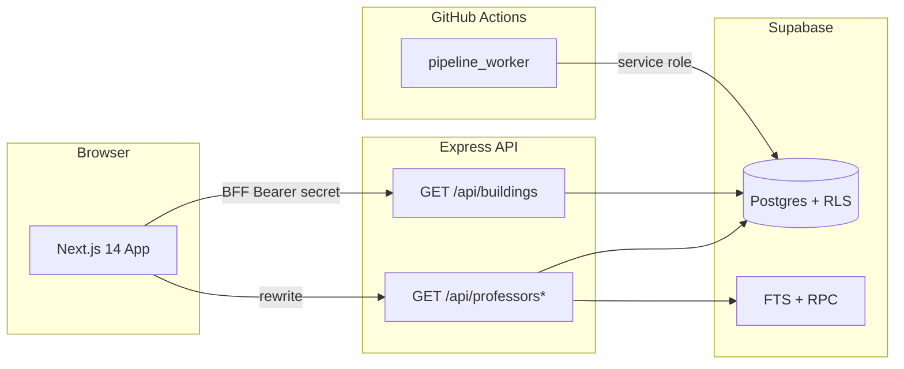

# Dickinson Study Spaces

Campus intelligence for Dickinson College — discover study spaces on an interactive Mapbox map, browse buildings with live open/closed status, and find faculty by department, office hours, and real-time availability.

**Production:** [https://dson-study-spaces.vercel.app/home](https://dson-study-spaces.vercel.app/home)

Allow browser location access for distance-based sorting and the best map experience.

Deep system design (C4, ADRs, ingestion internals, security posture): **[ARCHITECTURE.md](ARCHITECTURE.md)**.

Package docs: **[front-end/README.md](front-end/README.md)** · **[back-end/README.md](back-end/README.md)**

---

## Features

### Study spaces
- Interactive campus map (Mapbox GL JS)
- Building cards with hours, open/closed status, photos, and ratings
- Sort by Closest / Furthest / Highest Rated / Name; filter by Open / Closed
- Building directory with department → building mapping

### Faculty discovery
- Full-text search across name, title, department, and bio (Postgres FTS)
- Filter by department and building
- Office hours via a temporal model (active rows only: `valid_until IS NULL`)
- **Live mode** — highlights buildings where faculty are in office now (campus ET, refreshes every 60s)
- **Time travel** — preview which buildings would be active at any hour of the day

### Data pipeline
- Weekly faculty ingestion via GitHub Actions (`pipeline_worker/`)
- Playwright discovery → aiohttp fetch → BeautifulSoup / FSM parse → Supabase upsert
- Identity-key upserts: `email` → `profile_url` → `fac_id` (never name-only)
- RLS: public `SELECT`; writes require the service role

---

## Architecture (overview)



| Layer | Stack |
|-------|-------|
| Frontend | Next.js 14 (App Router), React 18, Tailwind CSS, TanStack Query, Radix UI, Mapbox GL JS |
| Backend | Node.js 22, Express, `@supabase/supabase-js` |
| Database | Supabase (PostgreSQL), FTS, temporal office-hours schema, RLS |
| Ingestion | Python 3.10+, Poetry, Playwright, Pydantic, BeautifulSoup, aiohttp |
| Deployment | Vercel (frontend + API), GitHub Actions (pipeline) |

---

## Repository layout

```
dson-study-spaces/
├── front-end/              Next.js app — see front-end/README.md
├── back-end/               Express API — see back-end/README.md
├── pipeline_worker/        Faculty ingestion (Poetry) — source of truth for writes
├── crawler/                Deprecated Node scraper (do not schedule)
├── supabase/migrations/    Ordered SQL migrations (apply before running the app)
├── .github/workflows/      Faculty pipeline (Sun 02:00 UTC) + deprecated scraper stub
├── ARCHITECTURE.md         System design, ADRs, threat model
└── package.json            npm workspaces root (front-end, back-end, crawler)
```

---

## Prerequisites

- **Node.js 22.x** and npm (workspaces)
- **Python 3.10+** and [Poetry](https://python-poetry.org/) (pipeline only)
- A **Supabase** project (see [Database bootstrap](#3-apply-database-migrations) — base tables are not created by repo migrations)
- A **Mapbox** public access token ([create one](https://account.mapbox.com/access-tokens/))

---

## Getting started

### 1. Clone and install

```powershell
git clone https://github.com/hmhngx/dson-study-spaces.git
cd dson-study-spaces
npm install
```

### 2. Configure environment

Create **`back-end/.env`** from [`back-end/.env.example`](back-end/.env.example) (keep secrets out of git):

```env
SUPABASE_URL=https://your-project.supabase.co
SUPABASE_SERVICE_ROLE_KEY=your-service-role-key
INTERNAL_API_SECRET=your-shared-secret
INTERNAL_CRON_SECRET=your-cron-secret
PORT=3002
```

Create **`front-end/.env.local`** from [`front-end/.env.example`](front-end/.env.example):

```env
INTERNAL_API_SECRET=your-shared-secret
NEXT_PUBLIC_MAPBOX_TOKEN=pk.your-mapbox-public-token
NEXT_PUBLIC_API_URL=http://localhost:3000
BACKEND_URL=http://localhost:3002
```

Notes:

- `INTERNAL_API_SECRET` must match between frontend and backend. `INTERNAL_API_KEY` is accepted as an alias for the same value.
- Browser calls should hit the **Next.js origin** (`NEXT_PUBLIC_API_URL=http://localhost:3000`). Buildings go through the BFF route handler; other `/api/*` paths are rewritten to `BACKEND_URL`.
- `BACKEND_URL` is **server-only** (BFF `fetch` + rewrites). Without it in local dev, rewrites fall back to `NEXT_PUBLIC_API_URL` and can mis-route.

### 3. Apply database migrations

Repo migrations **assume** `professors`, `departments`, and `buildings` already exist in Supabase. They do **not** contain base `CREATE TABLE` DDL for those tables. Create or restore that schema first (or clone from an existing project), then run these files **in filename order**:

1. `supabase/migrations/20250314000000_temporal_professor_schema.sql`
2. `supabase/migrations/20250404000000_professor_fts.sql`
3. `supabase/migrations/20250525000000_professor_identity_keys.sql`
4. `supabase/migrations/20250526000000_enable_public_read_rls.sql`

Then seed buildings and map departments (requires service-role credentials in `back-end/.env`):

```powershell
npm run seed:buildings -w back-end
npm run map:departments -w back-end
```

### 4. Run locally

**Terminal 1 — API** (port 3002):

```powershell
npm run dev:api
```

**Terminal 2 — frontend** (port 3000):

```powershell
npm run dev
```

Open [http://localhost:3000/home](http://localhost:3000/home). Both servers must be running for building and professor data to load.

---

## Environment reference

### Frontend (`front-end/.env.local`)

| Variable | Required | Description |
|----------|----------|-------------|
| `INTERNAL_API_SECRET` | Yes | Shared secret for the `/api/buildings` BFF (`INTERNAL_API_KEY` alias also works) |
| `NEXT_PUBLIC_MAPBOX_TOKEN` | Yes | Mapbox public token for the campus map |
| `NEXT_PUBLIC_API_URL` | Dev / prod | Browser-facing origin. Local: `http://localhost:3000`. On Vercel, may be omitted — resolved from `VERCEL_URL` at build time |
| `BACKEND_URL` | Dev / prod | Express origin for server-side BFF + rewrites (e.g. `http://localhost:3002` or the backend Vercel URL) |

### Backend (`back-end/.env`)

| Variable | Required | Description |
|----------|----------|-------------|
| `SUPABASE_URL` | Yes | Supabase project URL |
| `SUPABASE_SERVICE_ROLE_KEY` | Yes | Service-role key — **server only**, never expose to the client |
| `INTERNAL_API_SECRET` | Yes | Bearer token for `GET /api/buildings` (`INTERNAL_API_KEY` alias) |
| `INTERNAL_CRON_SECRET` | Yes | Auth for `POST /api/professors/sync` (legacy webhook) |
| `PORT` | No | Listen port (default `3002`) |
| `ALLOWED_ORIGIN_EXTRA` | No | One additional CORS origin (beyond localhost + `*.vercel.app`) |
| `DATABASE_URL` / `SUPABASE_DB_URL` | No | Optional; if set, must be the transaction pooler on port **6543** with `?pgbouncer=true` (port 5432 is rejected) |

### Pipeline (GitHub Actions secrets or local env)

| Variable | Required | Description |
|----------|----------|-------------|
| `SUPABASE_URL` | Yes | Supabase project URL |
| `SUPABASE_SERVICE_ROLE_KEY` | Yes | Service-role key for ingestion writes |

The orchestrator also loads a repo-root `.env` as a local fallback when present.

---

## Faculty pipeline

The Node crawler in `crawler/` is **deprecated**. Scheduled ingestion is **`pipeline_worker/` only**, writing **directly to Supabase** with the service role (not via `POST /api/professors/sync`).

### Automated (production)

[`.github/workflows/pipeline.yml`](.github/workflows/pipeline.yml) runs every **Sunday at 02:00 UTC** and supports `workflow_dispatch`. Configure repository secrets `SUPABASE_URL` and `SUPABASE_SERVICE_ROLE_KEY`.

The deprecated [`.github/workflows/scraper.yml`](.github/workflows/scraper.yml) is manual-only and **exits with code 1**.

### Manual (local)

```powershell
cd pipeline_worker
poetry install
poetry run playwright install chromium
$env:SUPABASE_URL = "https://your-project.supabase.co"
$env:SUPABASE_SERVICE_ROLE_KEY = "your-service-role-key"
poetry run python -m pipeline_worker.main_orchestrator
```

---

## Scripts

| Command | Description |
|---------|-------------|
| `npm run dev` | Start Next.js (port 3000) |
| `npm run dev:api` | Start Express with nodemon (port 3002) |
| `npm run build` | Production build (frontend) |
| `npm run start:api` | Start API without nodemon |
| `npm run seed:buildings -w back-end` | Upsert 19 buildings from `back-end/api/data/data.json` |
| `npm run map:departments -w back-end` | Map departments → `primary_building_id` |

---

## Deployment

Production: [https://dson-study-spaces.vercel.app/home](https://dson-study-spaces.vercel.app/home)

Frontend and backend are **separate Vercel projects**. Backend entrypoint for Vercel is `back-end/index.js` (re-exports `api/index.js` per `back-end/vercel.json`).

| Project | Required env |
|---------|----------------|
| Frontend | `INTERNAL_API_SECRET`, `NEXT_PUBLIC_MAPBOX_TOKEN`, `BACKEND_URL` (backend deployment URL). `NEXT_PUBLIC_API_URL` optional on Vercel |
| Backend | `SUPABASE_URL`, `SUPABASE_SERVICE_ROLE_KEY`, `INTERNAL_API_SECRET`, `INTERNAL_CRON_SECRET` |
| GitHub Actions | `SUPABASE_URL`, `SUPABASE_SERVICE_ROLE_KEY` |

Apply Supabase migrations before deploying API changes that depend on new schema.

```powershell
cd front-end
vercel --prod

cd ..\back-end
vercel --prod
```

---

## API overview

| Method | Path | Auth | Cache | Description |
|--------|------|------|-------|-------------|
| `GET` | `/` | None | — | Welcome JSON (not a health probe) |
| `GET` | `/api/buildings` | `Authorization: Bearer <INTERNAL_API_SECRET>` | 300s | Building list + open/closed + Supabase UUIDs |
| `GET` | `/api/professors` | Public | 60s | List/search; FTS when `q` is set |
| `GET` | `/api/professors/departments` | Public | 300s | All departments |
| `GET` | `/api/professors/active-now` | Public | 60s | Building UUIDs with faculty in office now (campus ET) |
| `POST` | `/api/professors/sync` | `INTERNAL_CRON_SECRET` | — | Legacy bulk upsert (no office hours) |

`GET /api/professors` query params: `q`, `department_id`, `building_id` (UUID or slug), `limit` (default 20, max 100), `offset`, `live_sync=true` / `all=true` (fetch up to 10k). Full behavior: [ARCHITECTURE.md](ARCHITECTURE.md).

Client may send `lat`/`lng` on buildings fetch for client-side distance sort; the Express buildings route **does not** use those query params.

---

## Design system

- **Typography** — active pairing: **DM Sans** (body) + **Space Grotesk** (headings), configured in `front-end/src/lib/fonts.js` (`FONT_CONFIG`)
- **Controls** — solid utility surfaces for readability; glassmorphic content panels on the map shell
- **Components** — Radix UI primitives + Tailwind in `front-end/src/ui/`

Open/closed and live-mode evaluation use campus timezone `America/New_York` on the primary UI paths. See [ARCHITECTURE.md](ARCHITECTURE.md) § timezone notes for known inconsistencies in fetch enrichment and the Express buildings status field.

---

## Contributing

1. Fork the repository
2. Create a feature branch: `git checkout -b feature/your-feature`
3. Commit with a clear message describing the *why*
4. Push and open a pull request

Before submitting: keep migrations idempotent, never commit secrets, ensure `npm run build` and `npm run start:api` succeed, and prefer extending `pipeline_worker` over resurrecting `crawler/`.

---

## License

ISC — see individual package manifests for details.
