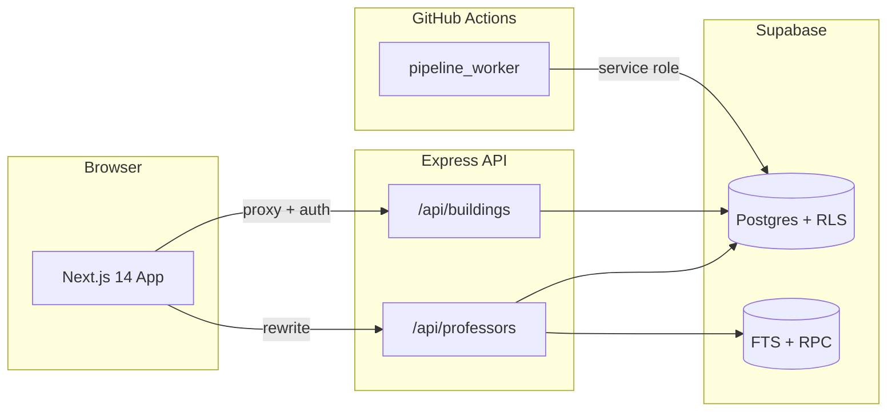

# Dickinson Study Spaces

A campus intelligence platform for Dickinson College — discover study spaces, explore buildings on an interactive map, and find faculty by department, office hours, and real-time availability.

**Live:** [dson-study-spaces.vercel.app/home](https://front-end-six-drab.vercel.app/home)
> Allow browser location access for distance-based sorting and the best map experience.

---

## Features

### Study spaces
- Interactive campus map powered by Mapbox
- Building cards with hours, open/closed status, and photos
- Sort by distance (Vincenty formula) or filter by availability
- Building directory with department-to-building mapping

### Faculty discovery
- Full-text professor search across name, title, department, and bio
- Filter by department and building
- Office-hours display with temporal data model (current-term slots only)
- **Live mode** — highlights buildings where faculty are in office right now (campus ET, refreshed every 60s)
- **Time travel** — preview which buildings would be active at any hour of the day

### Data pipeline
- Automated weekly faculty ingestion via GitHub Actions (`pipeline_worker/`)
- Playwright-based discovery, HTML parsing, and structured office-hours extraction
- Supabase persistence with identity-key upserts (`email`, `profile_url`, `fac_id`)
- Row-level security: public read, service-role write

---

## Architecture



| Layer | Stack |
|-------|-------|
| Frontend | Next.js 14, React 18, Tailwind CSS, TanStack Query, Radix UI |
| Backend | Node.js 22, Express, `@supabase/supabase-js` |
| Database | Supabase (Postgres), full-text search, temporal office-hours schema |
| Ingestion | Python 3.10+, Poetry, Playwright, Pydantic, BeautifulSoup |
| Mapping | Mapbox GL JS |
| Deployment | Vercel (frontend + API), GitHub Actions (pipeline) |

---

## Repository layout

```
dson-study-spaces/
├── front-end/          Next.js app (App Router)
├── back-end/           Express API + Supabase client
├── pipeline_worker/    Faculty ingestion pipeline (Poetry)
├── crawler/            Deprecated Node scraper (superseded by pipeline_worker)
├── supabase/
│   └── migrations/     Ordered SQL migrations — apply before running the app
└── .github/workflows/  Scheduled faculty pipeline (Sundays 02:00 UTC)
```

---

## Prerequisites

- **Node.js 22.x** and npm (workspaces)
- **Python 3.10+** and [Poetry](https://python-poetry.org/) (pipeline only)
- A **Supabase** project with migrations applied
- **Mapbox** public access token ([create one](https://account.mapbox.com/access-tokens/))

---

## Getting started

### 1. Clone and install

```powershell
git clone https://github.com/hmhngx/dson-study-spaces.git
cd dson-study-spaces
npm install
```

### 2. Configure environment

**`back-end/.env`**

```env
SUPABASE_URL=https://your-project.supabase.co
SUPABASE_SERVICE_ROLE_KEY=your-service-role-key
INTERNAL_API_SECRET=your-shared-secret
INTERNAL_CRON_SECRET=your-cron-secret
PORT=3002
```

**`front-end/.env.local`**

```env
INTERNAL_API_SECRET=your-shared-secret
NEXT_PUBLIC_MAPBOX_TOKEN=pk.your-mapbox-public-token
NEXT_PUBLIC_API_URL=http://localhost:3000
BACKEND_URL=http://localhost:3002
```

`INTERNAL_API_SECRET` must match between frontend and backend. Browser requests to `/api/*` are served by Next.js — building data through an authenticated route handler, professor routes via rewrite to the Express API.

### 3. Apply database migrations

Run the SQL files in `supabase/migrations/` **in filename order** against your Supabase project:

1. `20250314000000_temporal_professor_schema.sql`
2. `20250404000000_professor_fts.sql`
3. `20250525000000_professor_identity_keys.sql`
4. `20250526000000_enable_public_read_rls.sql`

Then seed buildings and map departments (requires service-role credentials in `back-end/.env`):

```powershell
npm run seed:buildings -w back-end
npm run map:departments -w back-end
```

### 4. Run locally

**Terminal 1 — API** (port 3002):

```powershell
npm run dev:api
```

**Terminal 2 — frontend** (port 3000):

```powershell
npm run dev
```

Open [http://localhost:3000/home](http://localhost:3000/home).

Both servers must be running for building and professor data to load.

---

## Environment reference

### Frontend (`front-end/.env.local`)

| Variable | Required | Description |
|----------|----------|-------------|
| `INTERNAL_API_SECRET` | Yes | Shared secret for the `/api/buildings` proxy |
| `NEXT_PUBLIC_MAPBOX_TOKEN` | Yes | Mapbox public token for the campus map |
| `NEXT_PUBLIC_API_URL` | Dev | Browser-facing origin (use `http://localhost:3000`; resolves from `VERCEL_URL` on Vercel) |
| `BACKEND_URL` | Dev | Express origin for server-side proxy (e.g. `http://localhost:3002`) |

### Backend (`back-end/.env`)

| Variable | Required | Description |
|----------|----------|-------------|
| `SUPABASE_URL` | Yes | Supabase project URL |
| `SUPABASE_SERVICE_ROLE_KEY` | Yes | Service-role key (server only — never expose to the client) |
| `INTERNAL_API_SECRET` | Yes | Bearer token for `GET /api/buildings` |
| `INTERNAL_CRON_SECRET` | Yes | Auth for `POST /api/professors/sync` |
| `PORT` | No | Listen port (default `3002`) |
| `ALLOWED_ORIGIN_EXTRA` | No | Additional CORS origin for local/staging |

### Pipeline (GitHub Actions secrets or local `.env`)

| Variable | Required | Description |
|----------|----------|-------------|
| `SUPABASE_URL` | Yes | Supabase project URL |
| `SUPABASE_SERVICE_ROLE_KEY` | Yes | Service-role key for ingestion writes |

---

## Faculty pipeline

The Node crawler in `crawler/` is **deprecated**. Ingestion is handled by `pipeline_worker/`.

### Automated (production)

The **Faculty pipeline** workflow (`.github/workflows/pipeline.yml`) runs every Sunday at 02:00 UTC and can be triggered manually via `workflow_dispatch`. Configure `SUPABASE_URL` and `SUPABASE_SERVICE_ROLE_KEY` as GitHub repository secrets.

### Manual (local)

```powershell
cd pipeline_worker
poetry install
poetry run playwright install chromium
$env:SUPABASE_URL = "https://your-project.supabase.co"
$env:SUPABASE_SERVICE_ROLE_KEY = "your-service-role-key"
poetry run python -m pipeline_worker.main_orchestrator
```

---

## Scripts

| Command | Description |
|---------|-------------|
| `npm run dev` | Start Next.js dev server |
| `npm run dev:api` | Start Express API with nodemon |
| `npm run build` | Production build (frontend) |
| `npm run start:api` | Start API without nodemon |
| `npm run seed:buildings -w back-end` | Seed buildings from `data.json` into Supabase |
| `npm run map:departments -w back-end` | Map departments to buildings |

---

## Deployment

Production URL: [dson-study-spaces.vercel.app/home](https://dson-study-spaces.vercel.app/home)

The frontend and backend deploy as separate Vercel projects. The backend entrypoint for Vercel is `back-end/index.js`, which re-exports the Express app from `api/index.js`.

**Frontend** — set all variables from the frontend table above. On Vercel, `NEXT_PUBLIC_API_URL` can be omitted; it resolves from `VERCEL_URL` at build time.

**Backend** — set all variables from the backend table. Ensure Supabase migrations are applied before deploying API changes that depend on new schema.

**GitHub Actions** — add Supabase secrets for the faculty pipeline.

```powershell
cd front-end
vercel --prod

cd ..\back-end
vercel --prod
```

---

## API overview

| Method | Path | Auth | Description |
|--------|------|------|-------------|
| `GET` | `/api/buildings` | `Bearer INTERNAL_API_SECRET` | Building list with open/closed status and Supabase UUIDs |
| `GET` | `/api/professors` | Public | Search and list professors (FTS when `q` is set) |
| `GET` | `/api/professors/departments` | Public | All departments |
| `GET` | `/api/professors/active-now` | Public | Building IDs with faculty in office now |
| `POST` | `/api/professors/sync` | `INTERNAL_CRON_SECRET` | Bulk upsert from ingestion pipeline |

---

## Design system

Built on Material 3 principles with a dual-surface approach:

- **Utility controls** — solid backgrounds for readability and accessibility
- **Content surfaces** — glassmorphic cards, tooltips, and panels
- **Typography** — configurable via `front-end/src/lib/fonts.js` (Inter, Poppins, and others)
- **Components** — Radix UI primitives with Tailwind; see `front-end/src/ui/`

---

## Contributing

1. Fork the repository
2. Create a feature branch: `git checkout -b feature/your-feature`
3. Commit with a clear message describing the *why*
4. Push and open a pull request

Ensure migrations are idempotent, secrets stay out of version control, and both `npm run build` and the API start cleanly before submitting.

---

## License

ISC — see individual package manifests for details.
